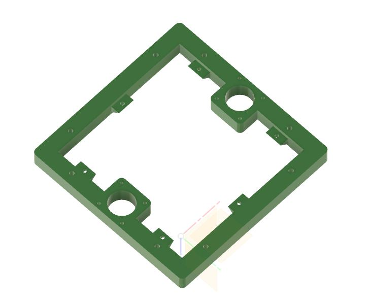
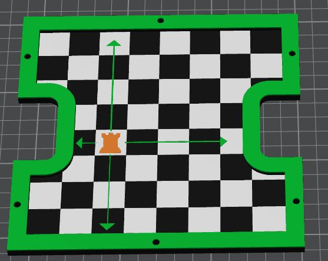
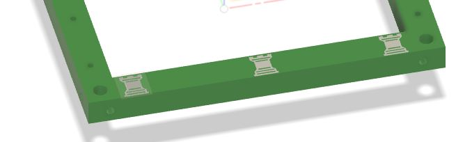
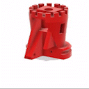
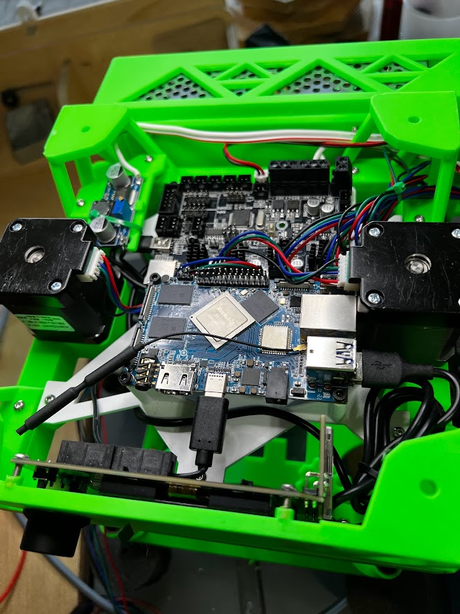

# ROOK - mods by robandwend (Robertg)

## Modifications in the build

### Base Plate

The Base plate is designed to cover up any electronics added under the bed, and give a visual pop.

### Bottom Frame changes
* Minor chamfers added 
* Added small shelves with inset holes to support a Base Plate

### Legs
* Fillet to match the Base Plate above

### Top Plate

Rook Graphic added

## Idlers

These have been rook-ified (otherwise should fit exactly as before)

## Base

The base has been extended to fit a Mini12864 display - with a front facing Card Slot https://www.aliexpress.com/item/1005003004180753.html. If no display required, you could just use 4 of the rear legs.

## Mounts

Three mounts are available for an orange-pi (4 lts) a MKS Robin E3 v1.1 board (the cheaper option in the rolo's original bom) and a buck-converter (for the PI).

Note that I've moved the PI above the Robin to ease plug and card insertion. This requires the extra high offered by the base changes.

## PSU

A simple PSU box has been made to fit a 'standard?' size PSU, it connects to the frame using a simple L bracket. If you don't have the taller Base - then the connections for the bracket (or the bracket) will need changing.

